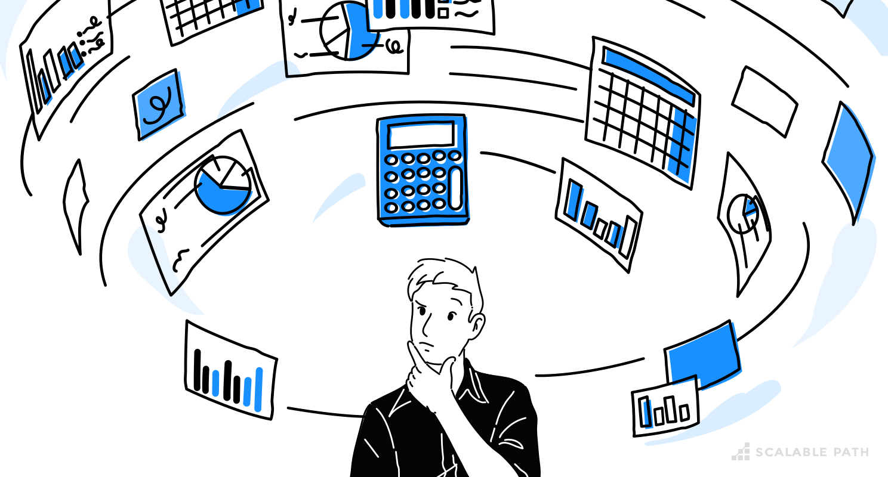

 
At UH Manoa, all students in ICS 314 are required to do a final project with their peers that involves the creation and deployment of a working website. 
My group decided to work on a website called ArtHub that is designed to facillitate connections between artists as it can be quite difficult for those just geting started
to share their works. As part of the final project, the group decided to estimate and track our coding and non-coding times. The benefit of doing so is that
we get good idea of how much effort it will take to comeplete tasks, thus allowing for more efficient task assignments and overall completions.

## Methods for making estimates
Effort estimates were decided based on our individual skills. Group members chose tasks that they thought they could handle. Since much of the initial work was 
just creating page mock-ups, something that we have been doing all semester, we related our previous WOD times to give us an idea of how long each mock-up would take.

## Benefits of estimating
One benefit I noticed when estimating the completion times for our tasks is that it allowed me some idea of how to structure my day. If I knew that it might take
at minimum an hour to work on a feature then I could incorporate a block period where I work on that issue. Of course estimates are just that; an estimate. However, 
time management is an important skill to have and even an estimatation is extremely useful when working on many things throughout the day.

## Benefits of actual time tracking
Tracking actual effort did come with a few benefits I think. For one, it gave us a reality check! As it turns out, creating a website from scratch and without
instructions can be quite a monumental task. The bootstrap-React framework thankfully made it a little easier because of all the pre-made components but figuring
out how best to structure the page for an optimal user experience is something I still need to work on. Second to that, tracking actual effort let us plan ahead
for future tasks. Since the landing page for example took me a few hours in acuallity, I can now compare that to future tasks that are similar and plan accordingly.

## Method for tracking our time
When tracking either coding or non-coding effort, it was important for each of us to have a method we were comfortable with. I personally used the stopwatch
timer on my phone to track both. Obviously some task issues couldn't be completed in one session and so when breaks were needed, I wrote down my stop time and when 
I was ready to work again, I would start a new timer and add that to my previous stop time to get the sum total.

## My takeaway from project estimation
Overall, I would say it really doesn't take much to press the start button on a timer and the benefits of doing so are worth it. Doing this hasn't afftected
me personally that much in terms of time usage. Again, all it takes is noting down your start/stop times. Now that I have an idea of how long certain tasks
actually take, I implement a plan to comeplete my tasks more efficiently, although maybe not always faster.
