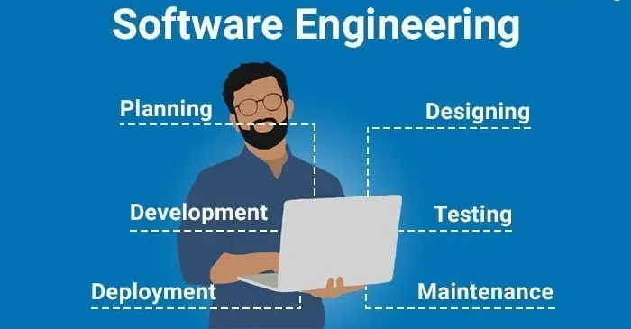

 

As I wrap up my junior year in the ICS program at UH Manoa, I can safely say that I finally understand what it means to be a software engineer. The ICS 314 class 'Software Engineering' was especially integral to realizing this. We learned many concepts, ranging from functional programming and coding standards to lesser-covered topics such as design patterns and agile project management. Software engineering is more than just writing code, it's using learned techniques to bring multiple pieces of a project together (including the code) efficiently and ethically. Two concepts I would like to talk about specifically that helped my understanding of software engineering are coding standards and user interface frameworks. 

## Coding Standards
With a small and simple software project, you could surely get away with bits of random spaghetti code (Spaghetti code - A term used for code that is messy and does not conform to any standards). This is especially true if you are going to be the only developer to ever touch the code. However, once a project begins to scale past a few files and is worked on by more than a few people, the need for enforced coding standards grows exponentially. Let's say Brian from the development team sends a seemingly working bundle of code over to John, who is on the testing team. John notices that there is a bug in the code, but when he tries to debug it, he begins having trouble understanding what exactly is going on. The code is a mess and hard to read! This is why coding standards on large-scale projects are imperative. To have coding standards is to be explicit, clear, and efficient in what you are creating. As a software engineer, much of the work you do will certainly be on enterprise software, and thus, you will work with many other engineers and have to read over not only your code but others' as well. 

## User Interface Frameworks
The second key concept I learned that helped in my understanding of what software engineering is is user interface frameworks. Frameworks in general are like toolkits for development. They include nearly all the necessary tools needed to bring a website to life and offer scalability as your project gets larger. Okay, so now you're probably thinking, "What part of what you just explained has anything to do with understanding software engineering?". Well, to be clear, it's less about what frameworks are and more about how and why they're used. As I mentioned earlier, software engineering is all about using techniques to bring multiple pieces of the pie together efficiently to create something amazing. In this instance, and continuing with the framework-toolkit analogy, why build a wrench when you can just pick one out of your toolkit? It was this concept that opened my eyes to not only how applications are built, but also provided the idea in my head that one should use all the tools available to them and not re-invent the wheel, so to speak.

## Final Thoughts
In conclusion, this past semester has helped greatly with my understanding of what it truly means to be a software engineer. ICS 314 is more than just learning how to write up a web application; it taught me how to work smarter and more collaboratively within a team. Concepts like coding standards and user interface frameworks showed me that software engineering is as much about communication, organization, and using all your available resources efficiently as it is about simply writing code. Following consistent code practices ensures clarity and teamwork, while leveraging frameworks highlights the importance of efficiency and scalability in enterprise development. These lessons, along with many others, have given me the confidence I need as I move forward into my senior year and beyond. I now see software engineering as a structured process. One that involves solving problems not in isolation, but with careful planning, shared tools, and teamwork.

